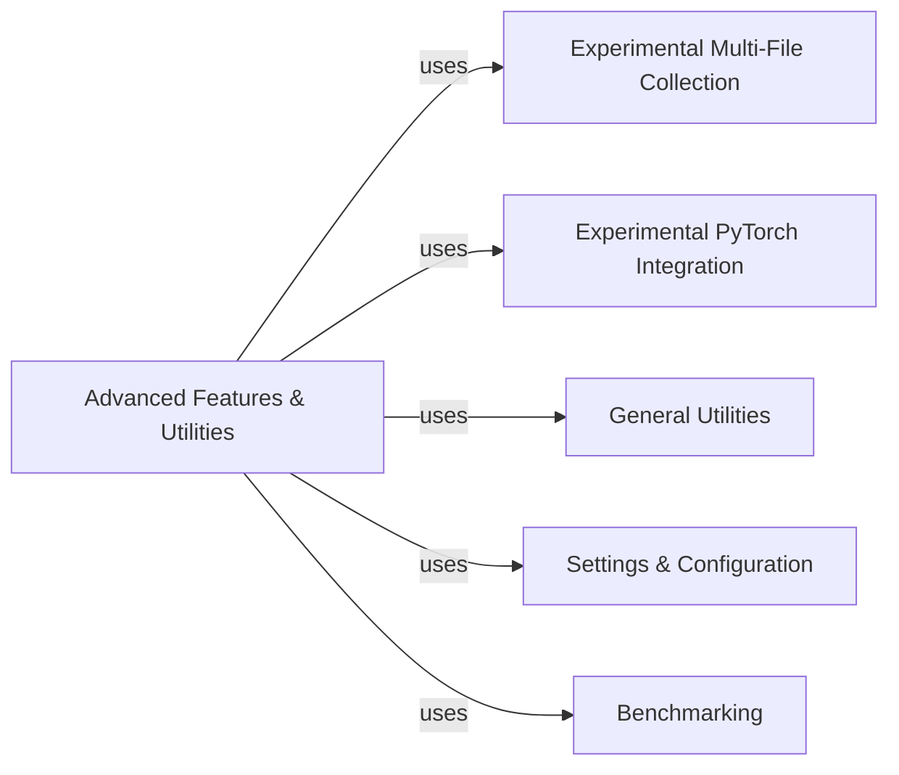

## Component Details

This graph illustrates the structure and interactions of the 'Advanced Features & Utilities' component within the AnnData project. This component serves as a hub for experimental functionalities, integrating multi-file AnnData collections, PyTorch utilities, and general-purpose helper functions for tasks like logging, settings management, and performance benchmarking. Its purpose is to provide cutting-edge and foundational tools that enhance the usability and extend the capabilities of AnnData objects, particularly for advanced data handling and analysis workflows.

### Advanced Features & Utilities

Encompasses experimental features for working with collections of AnnData objects, PyTorch integration, and general-purpose utility functions for common tasks, logging, settings management, and performance benchmarking.

**Related Classes/Methods**:

- <a href="https://github.com/scverse/anndata/blob/master/src/anndata/experimental/multi_files/_anncollection.py#L674-L806" target="_blank" rel="noopener noreferrer">`anndata.src.anndata.experimental.multi_files._anncollection.AnnCollection.__init__` (674:806)</a>

- <a href="https://github.com/scverse/anndata/blob/master/src/anndata/utils.py#L368-L398" target="_blank" rel="noopener noreferrer">`anndata.src.anndata.utils.deprecated` (368:398)</a>

- <a href="https://github.com/scverse/anndata/blob/master/src/anndata/_settings.py#L202-L240" target="_blank" rel="noopener noreferrer">`anndata.src.anndata._settings.SettingsManager.register` (202:240)</a>

- <a href="https://github.com/scverse/anndata/blob/master/benchmarks/benchmarks/utils.py#L32-L37" target="_blank" rel="noopener noreferrer">`anndata.benchmarks.benchmarks.utils.get_anndata_memsize` (32:37)</a>

### Experimental Multi-File Collection

Enables the management and manipulation of collections of AnnData objects that are distributed across multiple files, providing a unified view.

**Related Classes/Methods**:

- `anndata.src.anndata.experimental.multi_files._anncollection` (full file reference)

### Experimental PyTorch Integration

Offers utilities and data loaders to seamlessly integrate AnnData objects with PyTorch for use in deep learning models.

**Related Classes/Methods**:

- `anndata.src.anndata.experimental.pytorch._annloader` (full file reference)

### General Utilities

A collection of general-purpose helper functions, including array conversions, deprecation warnings, memory usage reporting, and compatibility functions.

**Related Classes/Methods**:

- `anndata.src.anndata.utils` (full file reference)

- `anndata.src.anndata.logging` (full file reference)

- `anndata.src.anndata.compat` (full file reference)

### Settings & Configuration

Manages global application settings and environment variables, allowing for customization of AnnData's behavior.

**Related Classes/Methods**:

- `anndata.src.anndata._settings` (full file reference)

### Benchmarking

Contains modules and functions dedicated to performance benchmarking of AnnData operations, including memory and read/write speed tests.

**Related Classes/Methods**:

- `anndata.benchmarks.benchmarks` (full file reference)

### [FAQ](https://github.com/CodeBoarding/GeneratedOnBoardings/tree/main?tab=readme-ov-file#faq)