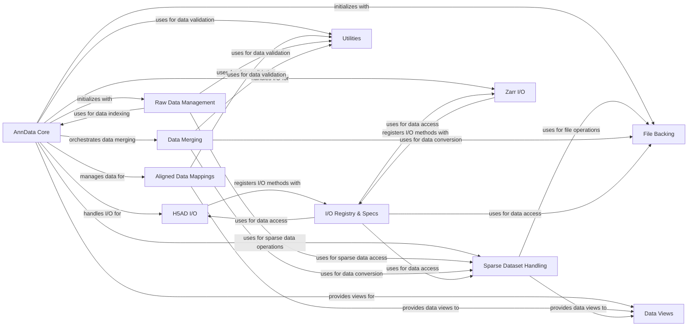

## Component Details

This graph represents the core components of the AnnData library, focusing on the central AnnData object and its interactions with various data management, I/O, and utility subsystems. The main flow revolves around the AnnData Core, which initializes and manages different data aspects, delegates I/O operations, and orchestrates data merging. Its purpose is to provide a robust and efficient data structure for annotated data matrices in single-cell biology.

### AnnData Core

The central data structure in the anndata library, representing annotated data matrices. It handles initialization, data storage (dense, sparse, backed), dimension management (obs, var), and basic operations like slicing, transposing, and copying. It delegates complex operations like I/O and merging to other specialized components.

**Related Classes/Methods**:

- <a href="https://github.com/scverse/anndata/blob/master/src/anndata/_core/anndata.py#L211-L257" target="_blank" rel="noopener noreferrer">`anndata.src.anndata._core.anndata.AnnData.__init__` (211:257)</a>

- `anndata.src.anndata._core.anndata.AnnData._init_as_view` (full file reference)

- `anndata.src.anndata._core.anndata.AnnData._init_as_actual` (full file reference)

- <a href="https://github.com/scverse/anndata/blob/master/src/anndata/_core/anndata.py#L547-L568" target="_blank" rel="noopener noreferrer">`anndata.src.anndata._core.anndata.AnnData.X` (547:568)</a>

- `anndata.src.anndata._core.anndata.AnnData.raw` (full file reference)

- `anndata.src.anndata._core.anndata.AnnData.obs` (full file reference)

- `anndata.src.anndata._core.anndata.AnnData.var` (full file reference)

- `anndata.src.anndata._core.anndata.AnnData.uns` (full file reference)

- `anndata.src.anndata._core.anndata.AnnData.__getitem__` (full file reference)

- `anndata.src.anndata._core.anndata.AnnData.__setitem__` (full file reference)

- `anndata.src.anndata._core.anndata.AnnData.copy` (full file reference)

- `anndata.src.anndata._core.anndata.AnnData.concatenate` (full file reference)

- `anndata.src.anndata._core.anndata.AnnData.write_h5ad` (full file reference)

- `anndata.src.anndata._core.anndata.AnnData.write_zarr` (full file reference)

### Data Merging

This component provides functionalities for concatenating and merging AnnData objects and their internal data structures (like arrays and dataframes). It includes logic for handling different data types, reindexing, and resolving merge strategies.

**Related Classes/Methods**:

- `anndata.src.anndata._core.merge.concat` (full file reference)

- `anndata.src.anndata._core.merge.merge_dataframes` (full file reference)

- `anndata.src.anndata._core.merge.concat_arrays` (full file reference)

- `anndata.src.anndata._core.merge.Reindexer` (full file reference)

- `anndata.src.anndata._core.merge.gen_reindexer` (full file reference)

- `anndata.src.anndata._core.merge.unify_dtypes` (full file reference)

### Raw Data Management

Manages the 'raw' attribute of an AnnData object, which typically stores the unnormalized or unscaled expression matrix. It provides methods for accessing, slicing, and copying this raw data, and can convert it back to a full AnnData object.

**Related Classes/Methods**:

- <a href="https://github.com/scverse/anndata/blob/master/src/anndata/_core/raw.py#L29-L60" target="_blank" rel="noopener noreferrer">`anndata.src.anndata._core.raw.Raw.__init__` (29:60)</a>

- <a href="https://github.com/scverse/anndata/blob/master/src/anndata/_core/raw.py#L68-L93" target="_blank" rel="noopener noreferrer">`anndata.src.anndata._core.raw.Raw.X` (68:93)</a>

- <a href="https://github.com/scverse/anndata/blob/master/src/anndata/_core/raw.py#L123-L139" target="_blank" rel="noopener noreferrer">`anndata.src.anndata._core.raw.Raw.__getitem__` (123:139)</a>

- <a href="https://github.com/scverse/anndata/blob/master/src/anndata/_core/raw.py#L149-L155" target="_blank" rel="noopener noreferrer">`anndata.src.anndata._core.raw.Raw.copy` (149:155)</a>

- <a href="https://github.com/scverse/anndata/blob/master/src/anndata/_core/raw.py#L157-L169" target="_blank" rel="noopener noreferrer">`anndata.src.anndata._core.raw.Raw.to_adata` (157:169)</a>

### Data Views

Provides lightweight, read-only views of underlying data structures (arrays, dataframes, sparse matrices, dictionaries) within an AnnData object. This prevents unnecessary data copying when only a subset or a different representation is needed.

**Related Classes/Methods**:

- <a href="https://github.com/scverse/anndata/blob/master/src/anndata/_core/views.py#L293-L295" target="_blank" rel="noopener noreferrer">`anndata.src.anndata._core.views.as_view` (293:295)</a>

- <a href="https://github.com/scverse/anndata/blob/master/src/anndata/_core/views.py#L105-L169" target="_blank" rel="noopener noreferrer">`anndata.src.anndata._core.views.ArrayView` (105:169)</a>

- <a href="https://github.com/scverse/anndata/blob/master/src/anndata/_core/views.py#L268-L289" target="_blank" rel="noopener noreferrer">`anndata.src.anndata._core.views.DataFrameView` (268:289)</a>

- <a href="https://github.com/scverse/anndata/blob/master/src/anndata/_core/views.py#L264-L265" target="_blank" rel="noopener noreferrer">`anndata.src.anndata._core.views.DictView` (264:265)</a>

- <a href="https://github.com/scverse/anndata/blob/master/src/anndata/_core/views.py#L35-L58" target="_blank" rel="noopener noreferrer">`anndata.src.anndata._core.views.view_update` (35:58)</a>

- <a href="https://github.com/scverse/anndata/blob/master/src/anndata/_core/views.py#L299-L300" target="_blank" rel="noopener noreferrer">`anndata.src.anndata._core.views.as_view_array` (299:300)</a>

### Aligned Data Mappings

Handles data structures that are aligned along one or both dimensions of the AnnData object, such as `obs`, `var`, `obsm`, `varm`, `obsp`, and `varp`. It ensures data consistency and provides validation for these aligned mappings.

**Related Classes/Methods**:

- <a href="https://github.com/scverse/anndata/blob/master/src/anndata/_core/aligned_mapping.py#L69-L102" target="_blank" rel="noopener noreferrer">`anndata.src.anndata._core.aligned_mapping.AlignedMappingBase._validate_value` (69:102)</a>

- <a href="https://github.com/scverse/anndata/blob/master/src/anndata/_core/aligned_mapping.py#L137-L198" target="_blank" rel="noopener noreferrer">`anndata.src.anndata._core.aligned_mapping.AlignedView` (137:198)</a>

- <a href="https://github.com/scverse/anndata/blob/master/src/anndata/_core/aligned_mapping.py#L201-L230" target="_blank" rel="noopener noreferrer">`anndata.src.anndata._core.aligned_mapping.AlignedActual` (201:230)</a>

- <a href="https://github.com/scverse/anndata/blob/master/src/anndata/_core/aligned_mapping.py#L290-L301" target="_blank" rel="noopener noreferrer">`anndata.src.anndata._core.aligned_mapping.AxisArrays` (290:301)</a>

- <a href="https://github.com/scverse/anndata/blob/master/src/anndata/_core/aligned_mapping.py#L361-L372" target="_blank" rel="noopener noreferrer">`anndata.src.anndata._core.aligned_mapping.PairwiseArrays` (361:372)</a>

### File Backing

Manages the backing of AnnData objects to disk, allowing for out-of-memory data handling. It provides mechanisms to open and manage file connections for data storage.

**Related Classes/Methods**:

- <a href="https://github.com/scverse/anndata/blob/master/src/anndata/_core/file_backing.py#L26-L37" target="_blank" rel="noopener noreferrer">`anndata.src.anndata._core.file_backing.AnnDataFileManager.__init__` (26:37)</a>

- <a href="https://github.com/scverse/anndata/blob/master/src/anndata/_core/file_backing.py#L123-L131" target="_blank" rel="noopener noreferrer">`anndata.src.anndata._core.file_backing.to_memory` (123:131)</a>

### Sparse Dataset Handling

Specializes in managing sparse matrix data, particularly when it is backed by a file. It provides methods for reading, writing, and manipulating sparse data efficiently, including slicing and appending operations.

**Related Classes/Methods**:

- `anndata.src.anndata._core.sparse_dataset.sparse_dataset` (full file reference)

- `anndata.src.anndata._core.sparse_dataset.BackedSparseMatrix` (full file reference)

- `anndata.src.anndata._core.sparse_dataset.BaseCompressedSparseDataset` (full file reference)

- `anndata.src.anndata._core.sparse_dataset.get_compressed_vector` (full file reference)

- `anndata.src.anndata._core.sparse_dataset.subset_by_major_axis_mask` (full file reference)

### H5AD I/O

Handles the reading and writing of AnnData objects to and from H5AD files, which is the primary file format for anndata. It manages the serialization and deserialization of various data types within the H5AD structure.

**Related Classes/Methods**:

- <a href="https://github.com/scverse/anndata/blob/master/src/anndata/_io/h5ad.py#L48-L114" target="_blank" rel="noopener noreferrer">`anndata.src.anndata._io.h5ad.write_h5ad` (48:114)</a>

- <a href="https://github.com/scverse/anndata/blob/master/src/anndata/_io/h5ad.py#L176-L273" target="_blank" rel="noopener noreferrer">`anndata.src.anndata._io.h5ad.read_h5ad` (176:273)</a>

- <a href="https://github.com/scverse/anndata/blob/master/src/anndata/_io/h5ad.py#L146-L173" target="_blank" rel="noopener noreferrer">`anndata.src.anndata._io.h5ad.read_h5ad_backed` (146:173)</a>

- <a href="https://github.com/scverse/anndata/blob/master/src/anndata/_io/h5ad.py#L315-L320" target="_blank" rel="noopener noreferrer">`anndata.src.anndata._io.h5ad.read_dataframe` (315:320)</a>

- <a href="https://github.com/scverse/anndata/blob/master/src/anndata/_io/h5ad.py#L324-L347" target="_blank" rel="noopener noreferrer">`anndata.src.anndata._io.h5ad.read_dataset` (324:347)</a>

### Zarr I/O

Provides functionalities for reading and writing AnnData objects to and from Zarr files, offering an alternative storage format. It handles the specific requirements for Zarr array and group structures.

**Related Classes/Methods**:

- <a href="https://github.com/scverse/anndata/blob/master/src/anndata/_io/zarr.py#L43-L79" target="_blank" rel="noopener noreferrer">`anndata.src.anndata._io.zarr.write_zarr` (43:79)</a>

- <a href="https://github.com/scverse/anndata/blob/master/src/anndata/_io/zarr.py#L82-L127" target="_blank" rel="noopener noreferrer">`anndata.src.anndata._io.zarr.read_zarr` (82:127)</a>

- <a href="https://github.com/scverse/anndata/blob/master/src/anndata/_io/zarr.py#L163-L168" target="_blank" rel="noopener noreferrer">`anndata.src.anndata._io.zarr.read_dataframe` (163:168)</a>

- <a href="https://github.com/scverse/anndata/blob/master/src/anndata/_io/zarr.py#L171-L176" target="_blank" rel="noopener noreferrer">`anndata.src.anndata._io.zarr.open_write_group` (171:176)</a>

### I/O Registry & Specs

Manages a registry of I/O methods and specifications for different data types and storage formats. It allows for flexible and extensible handling of data serialization and deserialization, ensuring compatibility across various data representations.

**Related Classes/Methods**:

- <a href="https://github.com/scverse/anndata/blob/master/src/anndata/_io/specs/registry.py#L98-L124" target="_blank" rel="noopener noreferrer">`anndata.src.anndata._io.specs.registry.IORegistry.register_write` (98:124)</a>

- <a href="https://github.com/scverse/anndata/blob/master/src/anndata/_io/specs/registry.py#L151-L164" target="_blank" rel="noopener noreferrer">`anndata.src.anndata._io.specs.registry.IORegistry.register_read` (151:164)</a>

- <a href="https://github.com/scverse/anndata/blob/master/src/anndata/_io/specs/registry.py#L485-L509" target="_blank" rel="noopener noreferrer">`anndata.src.anndata._io.specs.registry.write_elem` (485:509)</a>

- <a href="https://github.com/scverse/anndata/blob/master/src/anndata/_io/specs/registry.py#L391-L403" target="_blank" rel="noopener noreferrer">`anndata.src.anndata._io.specs.registry.read_elem` (391:403)</a>

- <a href="https://github.com/scverse/anndata/blob/master/src/anndata/_io/specs/registry.py#L39-L41" target="_blank" rel="noopener noreferrer">`anndata.src.anndata._io.specs.registry.IOSpec` (39:41)</a>

- <a href="https://github.com/scverse/anndata/blob/master/src/anndata/_io/specs/methods.py#L267-L285" target="_blank" rel="noopener noreferrer">`anndata.src.anndata._io.specs.methods.write_anndata` (267:285)</a>

- <a href="https://github.com/scverse/anndata/blob/master/src/anndata/_io/specs/methods.py#L294-L310" target="_blank" rel="noopener noreferrer">`anndata.src.anndata._io.specs.methods.read_anndata` (294:310)</a>

### Utilities

A collection of general utility functions used across the anndata library. These functions provide common operations like validation, deprecation warnings, index manipulation, and array conversions.

**Related Classes/Methods**:

- <a href="https://github.com/scverse/anndata/blob/master/src/anndata/utils.py#L421-L427" target="_blank" rel="noopener noreferrer">`anndata.src.anndata.utils.raise_value_error_if_multiindex_columns` (421:427)</a>

- <a href="https://github.com/scverse/anndata/blob/master/src/anndata/utils.py#L303-L315" target="_blank" rel="noopener noreferrer">`anndata.src.anndata.utils.ensure_df_homogeneous` (303:315)</a>

- <a href="https://github.com/scverse/anndata/blob/master/src/anndata/utils.py#L111-L117" target="_blank" rel="noopener noreferrer">`anndata.src.anndata.utils.axis_len` (111:117)</a>

- <a href="https://github.com/scverse/anndata/blob/master/src/anndata/utils.py#L218-L279" target="_blank" rel="noopener noreferrer">`anndata.src.anndata.utils.make_index_unique` (218:279)</a>

- <a href="https://github.com/scverse/anndata/blob/master/src/anndata/utils.py#L293-L300" target="_blank" rel="noopener noreferrer">`anndata.src.anndata.utils.warn_names_duplicates` (293:300)</a>

- <a href="https://github.com/scverse/anndata/blob/master/src/anndata/utils.py#L368-L398" target="_blank" rel="noopener noreferrer">`anndata.src.anndata.utils.deprecated` (368:398)</a>

- <a href="https://github.com/scverse/anndata/blob/master/src/anndata/utils.py#L48-L50" target="_blank" rel="noopener noreferrer">`anndata.src.anndata.utils.asarray` (48:50)</a>

### [FAQ](https://github.com/CodeBoarding/GeneratedOnBoardings/tree/main?tab=readme-ov-file#faq)