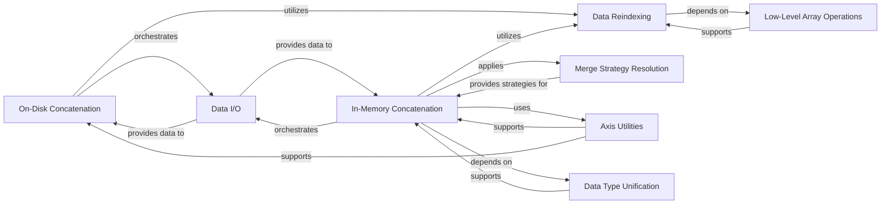

## Component Details

The Data Integration & Transformation subsystem in AnnData is responsible for combining and restructuring AnnData objects, handling both in-memory and on-disk operations. Its primary purpose is to facilitate the merging and concatenation of single-cell omics datasets, ensuring data consistency and efficient memory usage. The core flow involves reindexing data elements to align with new indices, applying various merge strategies for non-concatenated attributes, and unifying data types to maintain compatibility. It leverages specialized I/O components for persistent storage operations and low-level array utilities for efficient data manipulation.

### On-Disk Concatenation

Manages the concatenation of AnnData objects directly on disk, designed for large datasets to minimize memory footprint. It orchestrates reading, reindexing, and writing of data elements.

**Related Classes/Methods**:

- <a href="https://github.com/scverse/anndata/blob/master/src/anndata/experimental/merge.py#L411-L673" target="_blank" rel="noopener noreferrer">`anndata.src.anndata.experimental.merge.concat_on_disk` (411:673)</a>

- <a href="https://github.com/scverse/anndata/blob/master/src/anndata/experimental/merge.py#L397-L408" target="_blank" rel="noopener noreferrer">`anndata.src.anndata.experimental.merge._write_axis_annot` (397:408)</a>

- <a href="https://github.com/scverse/anndata/blob/master/src/anndata/experimental/merge.py#L389-L394" target="_blank" rel="noopener noreferrer">`anndata.src.anndata.experimental.merge._write_alt_annot` (389:394)</a>

- <a href="https://github.com/scverse/anndata/blob/master/src/anndata/experimental/merge.py#L379-L386" target="_blank" rel="noopener noreferrer">`anndata.src.anndata.experimental.merge._write_alt_mapping` (379:386)</a>

- <a href="https://github.com/scverse/anndata/blob/master/src/anndata/experimental/merge.py#L281-L322" target="_blank" rel="noopener noreferrer">`anndata.src.anndata.experimental.merge._write_concat_arrays` (281:322)</a>

- <a href="https://github.com/scverse/anndata/blob/master/src/anndata/experimental/merge.py#L246-L278" target="_blank" rel="noopener noreferrer">`anndata.src.anndata.experimental.merge._write_concat_mappings` (246:278)</a>

- <a href="https://github.com/scverse/anndata/blob/master/src/anndata/experimental/merge.py#L138-L156" target="_blank" rel="noopener noreferrer">`anndata.src.anndata.experimental.merge.read_as_backed` (138:156)</a>

- <a href="https://github.com/scverse/anndata/blob/master/src/anndata/experimental/merge.py#L159-L161" target="_blank" rel="noopener noreferrer">`anndata.src.anndata.experimental.merge._df_index` (159:161)</a>

- <a href="https://github.com/scverse/anndata/blob/master/src/anndata/experimental/merge.py#L58-L60" target="_blank" rel="noopener noreferrer">`anndata.src.anndata.experimental.merge._indices_equal` (58:60)</a>

- <a href="https://github.com/scverse/anndata/blob/master/src/anndata/experimental/merge.py#L102-L104" target="_blank" rel="noopener noreferrer">`anndata.src.anndata.experimental.merge.as_group` (102:104)</a>

### In-Memory Concatenation

Handles the concatenation of AnnData objects in memory, providing flexible options for joining and merging different parts of the AnnData structure. It coordinates data alignment and type unification.

**Related Classes/Methods**:

- <a href="https://github.com/scverse/anndata/blob/master/src/anndata/_core/merge.py#L1428-L1827" target="_blank" rel="noopener noreferrer">`anndata.src.anndata._core.merge.concat` (1428:1827)</a>

- <a href="https://github.com/scverse/anndata/blob/master/src/anndata/_core/anndata.py#L1790-L1800" target="_blank" rel="noopener noreferrer">`anndata.src.anndata._core.anndata.AnnData.concatenate` (1790:1800)</a>

- <a href="https://github.com/scverse/anndata/blob/master/src/anndata/_core/merge.py#L1000-L1030" target="_blank" rel="noopener noreferrer">`anndata.src.anndata._core.merge.concat_Xs` (1000:1030)</a>

- <a href="https://github.com/scverse/anndata/blob/master/src/anndata/_core/merge.py#L1033-L1060" target="_blank" rel="noopener noreferrer">`anndata.src.anndata._core.merge.inner_concat_aligned_mapping` (1033:1060)</a>

- <a href="https://github.com/scverse/anndata/blob/master/src/anndata/_core/merge.py#L1063-L1090" target="_blank" rel="noopener noreferrer">`anndata.src.anndata._core.merge.outer_concat_aligned_mapping` (1063:1090)</a>

- <a href="https://github.com/scverse/anndata/blob/master/src/anndata/_core/merge.py#L1093-L1120" target="_blank" rel="noopener noreferrer">`anndata.src.anndata._core.merge.concat_pairwise_mapping` (1093:1120)</a>

- <a href="https://github.com/scverse/anndata/blob/master/src/anndata/_core/merge.py#L1123-L1150" target="_blank" rel="noopener noreferrer">`anndata.src.anndata._core.merge.merge_dataframes` (1123:1150)</a>

- <a href="https://github.com/scverse/anndata/blob/master/src/anndata/_core/merge.py#L1153-L1200" target="_blank" rel="noopener noreferrer">`anndata.src.anndata._core.merge.concat_dataset2d_on_annot_axis` (1153:1200)</a>

- <a href="https://github.com/scverse/anndata/blob/master/src/anndata/_core/merge.py#L1203-L1220" target="_blank" rel="noopener noreferrer">`anndata.src.anndata._core.merge.make_xarray_extension_dtypes_dask` (1203:1220)</a>

### Data Reindexing

Provides the core logic for reindexing and aligning various data structures (e.g., DataFrames, sparse matrices, Dask arrays) based on a new index, handling missing values with a specified fill value.

**Related Classes/Methods**:

- <a href="https://github.com/scverse/anndata/blob/master/src/anndata/_core/merge.py#L470-L502" target="_blank" rel="noopener noreferrer">`anndata.src.anndata._core.merge.Reindexer` (470:502)</a>

- <a href="https://github.com/scverse/anndata/blob/master/src/anndata/_core/merge.py#L499-L502" target="_blank" rel="noopener noreferrer">`anndata.src.anndata._core.merge.Reindexer.__call__` (499:502)</a>

- <a href="https://github.com/scverse/anndata/blob/master/src/anndata/_core/merge.py#L480-L496" target="_blank" rel="noopener noreferrer">`anndata.src.anndata._core.merge.Reindexer.apply` (480:496)</a>

- <a href="https://github.com/scverse/anndata/blob/master/src/anndata/_core/merge.py#L505-L520" target="_blank" rel="noopener noreferrer">`anndata.src.anndata._core.merge.gen_reindexer` (505:520)</a>

- <a href="https://github.com/scverse/anndata/blob/master/src/anndata/_core/merge.py#L523-L540" target="_blank" rel="noopener noreferrer">`anndata.src.anndata._core.merge.gen_inner_reindexers` (523:540)</a>

- <a href="https://github.com/scverse/anndata/blob/master/src/anndata/_core/merge.py#L543-L560" target="_blank" rel="noopener noreferrer">`anndata.src.anndata._core.merge.gen_outer_reindexers` (543:560)</a>

### Data I/O

Manages the reading and writing of individual AnnData elements (like X, obs, var, layers) to and from persistent storage formats, abstracting the underlying file operations.

**Related Classes/Methods**:

- <a href="https://github.com/scverse/anndata/blob/master/src/anndata/_io/specs/registry.py#L391-L403" target="_blank" rel="noopener noreferrer">`anndata.src.anndata._io.specs.registry.read_elem` (391:403)</a>

- <a href="https://github.com/scverse/anndata/blob/master/src/anndata/_io/specs/registry.py#L485-L509" target="_blank" rel="noopener noreferrer">`anndata.src.anndata._io.specs.registry.write_elem` (485:509)</a>

- <a href="https://github.com/scverse/anndata/blob/master/src/anndata/_io/zarr.py#L171-L176" target="_blank" rel="noopener noreferrer">`anndata.src.anndata._io.zarr.open_write_group` (171:176)</a>

- <a href="https://github.com/scverse/anndata/blob/master/src/anndata/_core/file_backing.py#L123-L131" target="_blank" rel="noopener noreferrer">`anndata.src.anndata._core.file_backing.to_memory` (123:131)</a>

- <a href="https://github.com/scverse/anndata/blob/master/src/anndata/_core/sparse_dataset.py#L100-L110" target="_blank" rel="noopener noreferrer">`anndata.src.anndata._core.sparse_dataset.sparse_dataset` (100:110)</a>

### Merge Strategy Resolution

Defines and applies various strategies for combining non-concatenated data attributes (e.g., uns, obsm, varm) during the merge process, such as taking common, unique, or first values.

**Related Classes/Methods**:

- <a href="https://github.com/scverse/anndata/blob/master/src/anndata/_core/merge.py#L563-L580" target="_blank" rel="noopener noreferrer">`anndata.src.anndata._core.merge.resolve_merge_strategy` (563:580)</a>

- <a href="https://github.com/scverse/anndata/blob/master/src/anndata/_core/merge.py#L583-L600" target="_blank" rel="noopener noreferrer">`anndata.src.anndata._core.merge.merge_unique` (583:600)</a>

- <a href="https://github.com/scverse/anndata/blob/master/src/anndata/_core/merge.py#L603-L620" target="_blank" rel="noopener noreferrer">`anndata.src.anndata._core.merge.merge_same` (603:620)</a>

- <a href="https://github.com/scverse/anndata/blob/master/src/anndata/_core/merge.py#L623-L640" target="_blank" rel="noopener noreferrer">`anndata.src.anndata._core.merge.merge_first` (623:640)</a>

- <a href="https://github.com/scverse/anndata/blob/master/src/anndata/_core/merge.py#L643-L660" target="_blank" rel="noopener noreferrer">`anndata.src.anndata._core.merge.merge_only` (643:660)</a>

- <a href="https://github.com/scverse/anndata/blob/master/src/anndata/_core/merge.py#L663-L680" target="_blank" rel="noopener noreferrer">`anndata.src.anndata._core.merge.union_keys` (663:680)</a>

- <a href="https://github.com/scverse/anndata/blob/master/src/anndata/_core/merge.py#L683-L700" target="_blank" rel="noopener noreferrer">`anndata.src.anndata._core.merge.intersect_keys` (683:700)</a>

- <a href="https://github.com/scverse/anndata/blob/master/src/anndata/_core/merge.py#L703-L720" target="_blank" rel="noopener noreferrer">`anndata.src.anndata._core.merge.check_combinable_cols` (703:720)</a>

### Axis Utilities

Provides helper functions for resolving axis names (e.g., 'obs' or 0) and extracting indices along a specified axis, crucial for consistent axis-based operations.

**Related Classes/Methods**:

- <a href="https://github.com/scverse/anndata/blob/master/src/anndata/_core/merge.py#L723-L740" target="_blank" rel="noopener noreferrer">`anndata.src.anndata._core.merge._resolve_axis` (723:740)</a>

- <a href="https://github.com/scverse/anndata/blob/master/src/anndata/_core/merge.py#L743-L760" target="_blank" rel="noopener noreferrer">`anndata.src.anndata._core.merge.axis_indices` (743:760)</a>

- <a href="https://github.com/scverse/anndata/blob/master/src/anndata/_core/merge.py#L763-L780" target="_blank" rel="noopener noreferrer">`anndata.src.anndata._core.merge.merge_indices` (763:780)</a>

### Data Type Unification

Handles the process of unifying data types across multiple arrays or DataFrames to ensure compatibility during concatenation, often involving type promotion.

**Related Classes/Methods**:

- <a href="https://github.com/scverse/anndata/blob/master/src/anndata/_core/merge.py#L783-L800" target="_blank" rel="noopener noreferrer">`anndata.src.anndata._core.merge.unify_dtypes` (783:800)</a>

- <a href="https://github.com/scverse/anndata/blob/master/src/anndata/_core/merge.py#L803-L820" target="_blank" rel="noopener noreferrer">`anndata.src.anndata._core.merge.try_unifying_dtype` (803:820)</a>

### Low-Level Array Operations

Contains fundamental operations for handling and manipulating arrays, including sparse array conversions and default fill value determination.

**Related Classes/Methods**:

- <a href="https://github.com/scverse/anndata/blob/master/src/anndata/_core/merge.py#L823-L840" target="_blank" rel="noopener noreferrer">`anndata.src.anndata._core.merge.default_fill_value` (823:840)</a>

- <a href="https://github.com/scverse/anndata/blob/master/src/anndata/_core/merge.py#L843-L860" target="_blank" rel="noopener noreferrer">`anndata.src.anndata._core.merge.as_cp_sparse` (843:860)</a>

- <a href="https://github.com/scverse/anndata/blob/master/src/anndata/_core/merge.py#L863-L880" target="_blank" rel="noopener noreferrer">`anndata.src.anndata._core.merge.as_sparse` (863:880)</a>

- <a href="https://github.com/scverse/anndata/blob/master/src/anndata/_core/merge.py#L883-L900" target="_blank" rel="noopener noreferrer">`anndata.src.anndata._core.merge.concat_arrays` (883:900)</a>

### [FAQ](https://github.com/CodeBoarding/GeneratedOnBoardings/tree/main?tab=readme-ov-file#faq)