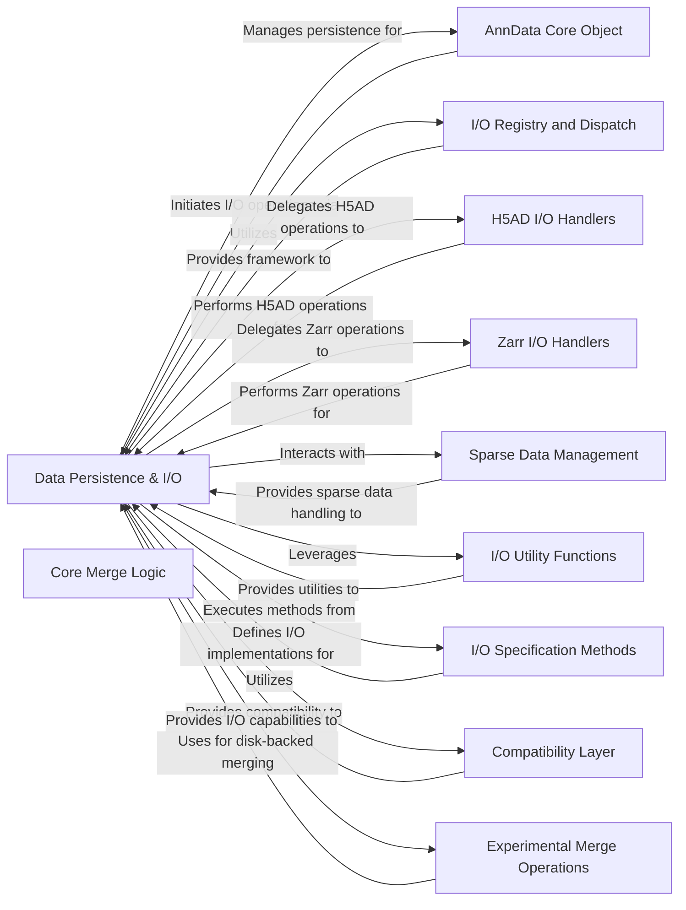

## Component Details

The `Data Persistence & I/O` component serves as the central orchestrator for all data input and output operations within the AnnData ecosystem. Its primary purpose is to manage the serialization and deserialization of AnnData objects across various file formats, including H5AD, Zarr, CSV, Loom, MTX, and Excel. This component ensures efficient data handling through mechanisms like file backing and lazy loading, optimizing memory usage for large datasets. It achieves its functionality by coordinating with specialized I/O handlers for different formats, leveraging a flexible I/O registry for dispatching operations, and utilizing a suite of utility functions for common I/O tasks. This comprehensive approach provides a robust, extensible, and performant framework for persistent storage and retrieval of annotated data matrices.

### Data Persistence & I/O

This component acts as the overarching system for managing data persistence and input/output operations within AnnData. It coordinates the serialization and deserialization of AnnData objects to and from various file formats (H5AD, Zarr, CSV, Loom, MTX, Excel). It leverages the I/O Registry and Dispatch for flexible I/O handling, interacts with specific format handlers (H5AD, Zarr), and incorporates mechanisms for file backing and lazy loading to optimize memory usage. Its purpose is to provide a robust and extensible framework for saving and loading AnnData objects.

**Related Classes/Methods**:

- <a href="https://github.com/scverse/anndata/blob/master/src/anndata/_io/h5ad.py#L48-L114" target="_blank" rel="noopener noreferrer">`anndata.src.anndata._io.h5ad.write_h5ad` (48:114)</a>

- <a href="https://github.com/scverse/anndata/blob/master/src/anndata/_io/specs/registry.py#L98-L124" target="_blank" rel="noopener noreferrer">`anndata.src.anndata._io.specs.registry.IORegistry.register_write` (98:124)</a>

- <a href="https://github.com/scverse/anndata/blob/master/src/anndata/_core/file_backing.py#L87-L99" target="_blank" rel="noopener noreferrer">`anndata.src.anndata._core.file_backing.AnnDataFileManager.open` (87:99)</a>

- <a href="https://github.com/scverse/anndata/blob/master/src/anndata/_io/zarr.py#L43-L79" target="_blank" rel="noopener noreferrer">`anndata.src.anndata._io.zarr.write_zarr` (43:79)</a>

### AnnData Core Object

This component represents the central AnnData object, which is the primary data structure for storing and manipulating annotated data matrices. It handles initialization, data access (X), copying, and high-level I/O operations like writing to H5AD, CSV, Loom, and Zarr formats.

**Related Classes/Methods**:

- <a href="https://github.com/scverse/anndata/blob/master/src/anndata/_core/anndata.py#L65-L2084" target="_blank" rel="noopener noreferrer">`anndata.src.anndata._core.anndata.AnnData` (65:2084)</a>

- <a href="https://github.com/scverse/anndata/blob/master/src/anndata/_core/anndata.py#L314-L472" target="_blank" rel="noopener noreferrer">`anndata.src.anndata._core.anndata.AnnData._init_as_actual` (314:472)</a>

- <a href="https://github.com/scverse/anndata/blob/master/src/anndata/_core/anndata.py#L547-L664" target="_blank" rel="noopener noreferrer">`anndata.src.anndata._core.anndata.AnnData.X` (547:664)</a>

- <a href="https://github.com/scverse/anndata/blob/master/src/anndata/_core/anndata.py#L959-L1001" target="_blank" rel="noopener noreferrer">`anndata.src.anndata._core.anndata.AnnData.filename` (959:1001)</a>

- <a href="https://github.com/scverse/anndata/blob/master/src/anndata/_core/anndata.py#L1002-L1005" target="_blank" rel="noopener noreferrer">`anndata.src.anndata._core.anndata.AnnData._set_backed` (1002:1005)</a>

- <a href="https://github.com/scverse/anndata/blob/master/src/anndata/_core/anndata.py#L1011-L1023" target="_blank" rel="noopener noreferrer">`anndata.src.anndata._core.anndata.AnnData.__delitem__` (1011:1023)</a>

- <a href="https://github.com/scverse/anndata/blob/master/src/anndata/_core/anndata.py#L1184-L1194" target="_blank" rel="noopener noreferrer">`anndata.src.anndata._core.anndata.AnnData.__setitem__` (1184:1194)</a>

- <a href="https://github.com/scverse/anndata/blob/master/src/anndata/_core/anndata.py#L1401-L1445" target="_blank" rel="noopener noreferrer">`anndata.src.anndata._core.anndata.AnnData.to_memory` (1401:1445)</a>

- <a href="https://github.com/scverse/anndata/blob/master/src/anndata/_core/anndata.py#L1447-L1472" target="_blank" rel="noopener noreferrer">`anndata.src.anndata._core.anndata.AnnData.copy` (1447:1472)</a>

- <a href="https://github.com/scverse/anndata/blob/master/src/anndata/_core/anndata.py#L1804-L1895" target="_blank" rel="noopener noreferrer">`anndata.src.anndata._core.anndata.AnnData.write_h5ad` (1804:1895)</a>

- <a href="https://github.com/scverse/anndata/blob/master/src/anndata/_core/anndata.py#L1899-L1920" target="_blank" rel="noopener noreferrer">`anndata.src.anndata._core.anndata.AnnData.write_csvs` (1899:1920)</a>

- <a href="https://github.com/scverse/anndata/blob/master/src/anndata/_core/anndata.py#L1923-L1937" target="_blank" rel="noopener noreferrer">`anndata.src.anndata._core.anndata.AnnData.write_loom` (1923:1937)</a>

- <a href="https://github.com/scverse/anndata/blob/master/src/anndata/_core/anndata.py#L1939-L1972" target="_blank" rel="noopener noreferrer">`anndata.src.anndata._core.anndata.AnnData.write_zarr` (1939:1972)</a>

### I/O Registry and Dispatch

This component manages the registration and dispatching of various I/O functions for different data types and file formats. It provides a flexible mechanism for reading and writing elements, allowing for extensibility and consistent handling of data serialization and deserialization.

**Related Classes/Methods**:

- <a href="https://github.com/scverse/anndata/blob/master/src/anndata/_io/specs/registry.py#L89-L216" target="_blank" rel="noopener noreferrer">`anndata.src.anndata._io.specs.registry.IORegistry` (89:216)</a>

- <a href="https://github.com/scverse/anndata/blob/master/src/anndata/_io/specs/registry.py#L39-L41" target="_blank" rel="noopener noreferrer">`anndata.src.anndata._io.specs.registry.IOSpec` (39:41)</a>

- <a href="https://github.com/scverse/anndata/blob/master/src/anndata/_io/specs/registry.py#L266-L287" target="_blank" rel="noopener noreferrer">`anndata.src.anndata._io.specs.registry.Reader` (266:287)</a>

- <a href="https://github.com/scverse/anndata/blob/master/src/anndata/_io/specs/registry.py#L290-L318" target="_blank" rel="noopener noreferrer">`anndata.src.anndata._io.specs.registry.LazyReader` (290:318)</a>

- <a href="https://github.com/scverse/anndata/blob/master/src/anndata/_io/specs/registry.py#L321-L388" target="_blank" rel="noopener noreferrer">`anndata.src.anndata._io.specs.registry.Writer` (321:388)</a>

- <a href="https://github.com/scverse/anndata/blob/master/src/anndata/_io/specs/registry.py#L391-L403" target="_blank" rel="noopener noreferrer">`anndata.src.anndata._io.specs.registry.read_elem` (391:403)</a>

- <a href="https://github.com/scverse/anndata/blob/master/src/anndata/_io/specs/registry.py#L406-L482" target="_blank" rel="noopener noreferrer">`anndata.src.anndata._io.specs.registry.read_elem_lazy` (406:482)</a>

- <a href="https://github.com/scverse/anndata/blob/master/src/anndata/_io/specs/registry.py#L485-L509" target="_blank" rel="noopener noreferrer">`anndata.src.anndata._io.specs.registry.write_elem` (485:509)</a>

- <a href="https://github.com/scverse/anndata/blob/master/src/anndata/_io/specs/registry.py#L513-L524" target="_blank" rel="noopener noreferrer">`anndata.src.anndata._io.specs.registry.read_elem_partial` (513:524)</a>

- <a href="https://github.com/scverse/anndata/blob/master/src/anndata/experimental/_dispatch_io.py#L18-L41" target="_blank" rel="noopener noreferrer">`anndata.src.anndata.experimental._dispatch_io.read_dispatched` (18:41)</a>

- <a href="https://github.com/scverse/anndata/blob/master/src/anndata/experimental/_dispatch_io.py#L44-L76" target="_blank" rel="noopener noreferrer">`anndata.src.anndata.experimental._dispatch_io.write_dispatched` (44:76)</a>

### H5AD I/O Handlers

This component specifically handles the reading and writing of AnnData objects to and from the H5AD file format. It includes functions for reading full AnnData objects, backed AnnData objects, dataframes, and datasets, as well as writing sparse data as dense.

**Related Classes/Methods**:

- <a href="https://github.com/scverse/anndata/blob/master/src/anndata/_io/h5ad.py#L48-L114" target="_blank" rel="noopener noreferrer">`anndata.src.anndata._io.h5ad.write_h5ad` (48:114)</a>

- <a href="https://github.com/scverse/anndata/blob/master/src/anndata/_io/h5ad.py#L119-L143" target="_blank" rel="noopener noreferrer">`anndata.src.anndata._io.h5ad.write_sparse_as_dense` (119:143)</a>

- <a href="https://github.com/scverse/anndata/blob/master/src/anndata/_io/h5ad.py#L146-L173" target="_blank" rel="noopener noreferrer">`anndata.src.anndata._io.h5ad.read_h5ad_backed` (146:173)</a>

- <a href="https://github.com/scverse/anndata/blob/master/src/anndata/_io/h5ad.py#L176-L273" target="_blank" rel="noopener noreferrer">`anndata.src.anndata._io.h5ad.read_h5ad` (176:273)</a>

- <a href="https://github.com/scverse/anndata/blob/master/src/anndata/_io/h5ad.py#L276-L292" target="_blank" rel="noopener noreferrer">`anndata.src.anndata._io.h5ad._read_raw` (276:292)</a>

- <a href="https://github.com/scverse/anndata/blob/master/src/anndata/_io/h5ad.py#L296-L312" target="_blank" rel="noopener noreferrer">`anndata.src.anndata._io.h5ad.read_dataframe_legacy` (296:312)</a>

- <a href="https://github.com/scverse/anndata/blob/master/src/anndata/_io/h5ad.py#L315-L320" target="_blank" rel="noopener noreferrer">`anndata.src.anndata._io.h5ad.read_dataframe` (315:320)</a>

- <a href="https://github.com/scverse/anndata/blob/master/src/anndata/_io/h5ad.py#L324-L347" target="_blank" rel="noopener noreferrer">`anndata.src.anndata._io.h5ad.read_dataset` (324:347)</a>

- <a href="https://github.com/scverse/anndata/blob/master/src/anndata/_io/h5ad.py#L351-L360" target="_blank" rel="noopener noreferrer">`anndata.src.anndata._io.h5ad.read_dense_as_sparse` (351:360)</a>

- <a href="https://github.com/scverse/anndata/blob/master/src/anndata/_io/h5ad.py#L363-L369" target="_blank" rel="noopener noreferrer">`anndata.src.anndata._io.h5ad.read_dense_as_csr` (363:369)</a>

- <a href="https://github.com/scverse/anndata/blob/master/src/anndata/_io/h5ad.py#L372-L377" target="_blank" rel="noopener noreferrer">`anndata.src.anndata._io.h5ad.read_dense_as_csc` (372:377)</a>

### Zarr I/O Handlers

This component is responsible for reading and writing AnnData objects to and from the Zarr file format. It includes functions for writing and reading Zarr groups, datasets, and dataframes, with considerations for Zarr version compatibility.

**Related Classes/Methods**:

- <a href="https://github.com/scverse/anndata/blob/master/src/anndata/_io/zarr.py#L43-L79" target="_blank" rel="noopener noreferrer">`anndata.src.anndata._io.zarr.write_zarr` (43:79)</a>

- <a href="https://github.com/scverse/anndata/blob/master/src/anndata/_io/zarr.py#L82-L127" target="_blank" rel="noopener noreferrer">`anndata.src.anndata._io.zarr.read_zarr` (82:127)</a>

- <a href="https://github.com/scverse/anndata/blob/master/src/anndata/_io/zarr.py#L131-L145" target="_blank" rel="noopener noreferrer">`anndata.src.anndata._io.zarr.read_dataset` (131:145)</a>

- <a href="https://github.com/scverse/anndata/blob/master/src/anndata/_io/zarr.py#L149-L159" target="_blank" rel="noopener noreferrer">`anndata.src.anndata._io.zarr.read_dataframe_legacy` (149:159)</a>

- <a href="https://github.com/scverse/anndata/blob/master/src/anndata/_io/zarr.py#L163-L168" target="_blank" rel="noopener noreferrer">`anndata.src.anndata._io.zarr.read_dataframe` (163:168)</a>

- <a href="https://github.com/scverse/anndata/blob/master/src/anndata/_io/zarr.py#L171-L176" target="_blank" rel="noopener noreferrer">`anndata.src.anndata._io.zarr.open_write_group` (171:176)</a>

### Sparse Data Management

This component handles the storage, manipulation, and I/O of sparse data matrices within AnnData. It provides classes and functions for backed sparse matrices (CSR and CSC), enabling efficient operations like slicing, copying, and appending, and interacts with the I/O registry for serialization.

**Related Classes/Methods**:

- `anndata.src.anndata._core.sparse_dataset.sparse_dataset` (full file reference)

- `anndata.src.anndata._core.sparse_dataset.BackedSparseMatrix` (full file reference)

- `anndata.src.anndata._core.sparse_dataset.BackedSparseMatrix.copy` (full file reference)

- `anndata.src.anndata._core.sparse_dataset.BackedSparseMatrix._set_many` (full file reference)

- `anndata.src.anndata._core.sparse_dataset.BackedSparseMatrix._zero_many` (full file reference)

- `anndata.src.anndata._core.sparse_dataset.backed_csr_matrix` (full file reference)

- `anndata.src.anndata._core.sparse_dataset.backed_csc_matrix` (full file reference)

- `anndata.src.anndata._core.sparse_dataset.subset_by_major_axis_mask` (full file reference)

- `anndata.src.anndata._core.sparse_dataset._get_group_format` (full file reference)

- `anndata.src.anndata._core.sparse_dataset.BaseCompressedSparseDataset` (full file reference)

- `anndata.src.anndata._core.sparse_dataset.BaseCompressedSparseDataset.__init__` (full file reference)

- `anndata.src.anndata._core.sparse_dataset.BaseCompressedSparseDataset.shape` (full file reference)

- `anndata.src.anndata._core.sparse_dataset.BaseCompressedSparseDataset.__getitem__` (full file reference)

- `anndata.src.anndata._core.sparse_dataset.BaseCompressedSparseDataset.__setitem__` (full file reference)

- `anndata.src.anndata._core.sparse_dataset.BaseCompressedSparseDataset.append` (full file reference)

- `anndata.src.anndata._core.sparse_dataset.BaseCompressedSparseDataset._to_backed` (full file reference)

- `anndata.src.anndata._core.sparse_dataset.BaseCompressedSparseDataset.to_memory` (full file reference)

### Experimental Merge Operations

This component provides experimental functionalities for merging AnnData objects, particularly focusing on on-disk concatenation. It handles the complex logic of combining data, annotations, and mappings from multiple AnnData objects while optimizing for disk-backed operations.

**Related Classes/Methods**:

- <a href="https://github.com/scverse/anndata/blob/master/src/anndata/experimental/merge.py#L63-L93" target="_blank" rel="noopener noreferrer">`anndata.src.anndata.experimental.merge._gen_slice_to_append` (63:93)</a>

- <a href="https://github.com/scverse/anndata/blob/master/src/anndata/experimental/merge.py#L138-L156" target="_blank" rel="noopener noreferrer">`anndata.src.anndata.experimental.merge.read_as_backed` (138:156)</a>

- <a href="https://github.com/scverse/anndata/blob/master/src/anndata/experimental/merge.py#L159-L161" target="_blank" rel="noopener noreferrer">`anndata.src.anndata.experimental.merge._df_index` (159:161)</a>

- <a href="https://github.com/scverse/anndata/blob/master/src/anndata/experimental/merge.py#L169-L197" target="_blank" rel="noopener noreferrer">`anndata.src.anndata.experimental.merge.write_concat_dense` (169:197)</a>

- <a href="https://github.com/scverse/anndata/blob/master/src/anndata/experimental/merge.py#L200-L243" target="_blank" rel="noopener noreferrer">`anndata.src.anndata.experimental.merge.write_concat_sparse` (200:243)</a>

- <a href="https://github.com/scverse/anndata/blob/master/src/anndata/experimental/merge.py#L246-L278" target="_blank" rel="noopener noreferrer">`anndata.src.anndata.experimental.merge._write_concat_mappings` (246:278)</a>

- <a href="https://github.com/scverse/anndata/blob/master/src/anndata/experimental/merge.py#L281-L322" target="_blank" rel="noopener noreferrer">`anndata.src.anndata.experimental.merge._write_concat_arrays` (281:322)</a>

- <a href="https://github.com/scverse/anndata/blob/master/src/anndata/experimental/merge.py#L325-L376" target="_blank" rel="noopener noreferrer">`anndata.src.anndata.experimental.merge._write_concat_sequence` (325:376)</a>

- <a href="https://github.com/scverse/anndata/blob/master/src/anndata/experimental/merge.py#L379-L386" target="_blank" rel="noopener noreferrer">`anndata.src.anndata.experimental.merge._write_alt_mapping` (379:386)</a>

- <a href="https://github.com/scverse/anndata/blob/master/src/anndata/experimental/merge.py#L389-L394" target="_blank" rel="noopener noreferrer">`anndata.src.anndata.experimental.merge._write_alt_annot` (389:394)</a>

- <a href="https://github.com/scverse/anndata/blob/master/src/anndata/experimental/merge.py#L397-L408" target="_blank" rel="noopener noreferrer">`anndata.src.anndata.experimental.merge._write_axis_annot` (397:408)</a>

- <a href="https://github.com/scverse/anndata/blob/master/src/anndata/experimental/merge.py#L411-L673" target="_blank" rel="noopener noreferrer">`anndata.src.anndata.experimental.merge.concat_on_disk` (411:673)</a>

### I/O Utility Functions

This component provides a collection of general utility functions used across various I/O operations. These include functions for type conversion, attribute reading/writing, error reporting, and handling chunking for efficient data processing.

**Related Classes/Methods**:

- <a href="https://github.com/scverse/anndata/blob/master/src/anndata/_io/utils.py#L95-L106" target="_blank" rel="noopener noreferrer">`anndata.src.anndata._io.utils.convert_string` (95:106)</a>

- <a href="https://github.com/scverse/anndata/blob/master/src/anndata/_io/utils.py#L131-L136" target="_blank" rel="noopener noreferrer">`anndata.src.anndata._io.utils.read_attribute` (131:136)</a>

- <a href="https://github.com/scverse/anndata/blob/master/src/anndata/_io/utils.py#L139-L144" target="_blank" rel="noopener noreferrer">`anndata.src.anndata._io.utils.write_attribute` (139:144)</a>

- <a href="https://github.com/scverse/anndata/blob/master/src/anndata/_io/utils.py#L180-L215" target="_blank" rel="noopener noreferrer">`anndata.src.anndata._io.utils.report_read_key_on_error` (180:215)</a>

- <a href="https://github.com/scverse/anndata/blob/master/src/anndata/_io/utils.py#L218-L253" target="_blank" rel="noopener noreferrer">`anndata.src.anndata._io.utils.report_write_key_on_error` (218:253)</a>

- <a href="https://github.com/scverse/anndata/blob/master/src/anndata/_io/utils.py#L312-L326" target="_blank" rel="noopener noreferrer">`anndata.src.anndata._io.utils.no_write_dataset_2d` (312:326)</a>

- <a href="https://github.com/scverse/anndata/blob/master/src/anndata/_io/utils.py#L61-L73" target="_blank" rel="noopener noreferrer">`anndata.src.anndata._io.utils.is_float` (61:73)</a>

- <a href="https://github.com/scverse/anndata/blob/master/src/anndata/_io/utils.py#L76-L82" target="_blank" rel="noopener noreferrer">`anndata.src.anndata._io.utils.is_int` (76:82)</a>

- <a href="https://github.com/scverse/anndata/blob/master/src/anndata/_io/utils.py#L85-L92" target="_blank" rel="noopener noreferrer">`anndata.src.anndata._io.utils.convert_bool` (85:92)</a>

- <a href="https://github.com/scverse/anndata/blob/master/src/anndata/_io/utils.py#L158-L163" target="_blank" rel="noopener noreferrer">`anndata.src.anndata._io.utils._get_display_path` (158:163)</a>

- <a href="https://github.com/scverse/anndata/blob/master/src/anndata/_io/utils.py#L166-L177" target="_blank" rel="noopener noreferrer">`anndata.src.anndata._io.utils.add_key_note` (166:177)</a>

- <a href="https://github.com/scverse/anndata/blob/master/src/anndata/_io/utils.py#L33-L58" target="_blank" rel="noopener noreferrer">`anndata.src.anndata._io.utils.idx_chunks_along_axis` (33:58)</a>

- <a href="https://github.com/scverse/anndata/blob/master/src/anndata/_io/write.py#L139-L150" target="_blank" rel="noopener noreferrer">`anndata.src.anndata._io.write._write_in_zarr_chunks` (139:150)</a>

- <a href="https://github.com/scverse/anndata/blob/master/src/anndata/_io/write.py#L126-L136" target="_blank" rel="noopener noreferrer">`anndata.src.anndata._io.write._get_chunk_indices` (126:136)</a>

### I/O Specification Methods

This component contains the concrete implementation of various I/O methods that are registered with the I/O Registry. These methods define how different data types (basic arrays, strings, record arrays, sparse matrices, dataframes, categoricals, nullable arrays, scalars) are read from and written to different storage formats (H5AD, Zarr).

**Related Classes/Methods**:

- <a href="https://github.com/scverse/anndata/blob/master/src/anndata/_io/specs/methods.py#L96-L99" target="_blank" rel="noopener noreferrer">`anndata.src.anndata._io.specs.methods.zarr_v3_compressor_compat` (96:99)</a>

- <a href="https://github.com/scverse/anndata/blob/master/src/anndata/_io/specs/methods.py#L134-L151" target="_blank" rel="noopener noreferrer">`anndata.src.anndata._io.specs.methods.read_basic` (134:151)</a>

- <a href="https://github.com/scverse/anndata/blob/master/src/anndata/_io/specs/methods.py#L156-L172" target="_blank" rel="noopener noreferrer">`anndata.src.anndata._io.specs.methods.read_basic_zarr` (156:172)</a>

- <a href="https://github.com/scverse/anndata/blob/master/src/anndata/_io/specs/methods.py#L190-L197" target="_blank" rel="noopener noreferrer">`anndata.src.anndata._io.specs.methods.read_indices` (190:197)</a>

- <a href="https://github.com/scverse/anndata/blob/master/src/anndata/_io/specs/methods.py#L200-L251" target="_blank" rel="noopener noreferrer">`anndata.src.anndata._io.specs.methods.read_partial` (200:251)</a>

- <a href="https://github.com/scverse/anndata/blob/master/src/anndata/_io/specs/methods.py#L254-L262" target="_blank" rel="noopener noreferrer">`anndata.src.anndata._io.specs.methods._read_partial` (254:262)</a>

- <a href="https://github.com/scverse/anndata/blob/master/src/anndata/_io/specs/methods.py#L267-L285" target="_blank" rel="noopener noreferrer">`anndata.src.anndata._io.specs.methods.write_anndata` (267:285)</a>

- <a href="https://github.com/scverse/anndata/blob/master/src/anndata/_io/specs/methods.py#L294-L310" target="_blank" rel="noopener noreferrer">`anndata.src.anndata._io.specs.methods.read_anndata` (294:310)</a>

- <a href="https://github.com/scverse/anndata/blob/master/src/anndata/_io/specs/methods.py#L315-L326" target="_blank" rel="noopener noreferrer">`anndata.src.anndata._io.specs.methods.write_raw` (315:326)</a>

- <a href="https://github.com/scverse/anndata/blob/master/src/anndata/_io/specs/methods.py#L336-L337" target="_blank" rel="noopener noreferrer">`anndata.src.anndata._io.specs.methods.read_null` (336:337)</a>

- <a href="https://github.com/scverse/anndata/blob/master/src/anndata/_io/specs/methods.py#L341-L343" target="_blank" rel="noopener noreferrer">`anndata.src.anndata._io.specs.methods.write_null_h5py` (341:343)</a>

- <a href="https://github.com/scverse/anndata/blob/master/src/anndata/_io/specs/methods.py#L347-L358" target="_blank" rel="noopener noreferrer">`anndata.src.anndata._io.specs.methods.write_null_zarr` (347:358)</a>

- <a href="https://github.com/scverse/anndata/blob/master/src/anndata/_io/specs/methods.py#L368-L369" target="_blank" rel="noopener noreferrer">`anndata.src.anndata._io.specs.methods.read_mapping` (368:369)</a>

- <a href="https://github.com/scverse/anndata/blob/master/src/anndata/_io/specs/methods.py#L374-L384" target="_blank" rel="noopener noreferrer">`anndata.src.anndata._io.specs.methods.write_mapping` (374:384)</a>

- <a href="https://github.com/scverse/anndata/blob/master/src/anndata/_io/specs/methods.py#L394-L402" target="_blank" rel="noopener noreferrer">`anndata.src.anndata._io.specs.methods.write_list` (394:402)</a>

- <a href="https://github.com/scverse/anndata/blob/master/src/anndata/_io/specs/methods.py#L416-L436" target="_blank" rel="noopener noreferrer">`anndata.src.anndata._io.specs.methods.write_basic` (416:436)</a>

- <a href="https://github.com/scverse/anndata/blob/master/src/anndata/_io/specs/methods.py#L462-L481" target="_blank" rel="noopener noreferrer">`anndata.src.anndata._io.specs.methods.write_chunked_dense_array_to_group` (462:481)</a>

- <a href="https://github.com/scverse/anndata/blob/master/src/anndata/_io/specs/methods.py#L493-L509" target="_blank" rel="noopener noreferrer">`anndata.src.anndata._io.specs.methods.write_basic_dask_zarr` (493:509)</a>

- <a href="https://github.com/scverse/anndata/blob/master/src/anndata/_io/specs/methods.py#L515-L531" target="_blank" rel="noopener noreferrer">`anndata.src.anndata._io.specs.methods.write_basic_dask_h5` (515:531)</a>

- <a href="https://github.com/scverse/anndata/blob/master/src/anndata/_io/specs/methods.py#L537-L538" target="_blank" rel="noopener noreferrer">`anndata.src.anndata._io.specs.methods.read_array` (537:538)</a>

- <a href="https://github.com/scverse/anndata/blob/master/src/anndata/_io/specs/methods.py#L543-L544" target="_blank" rel="noopener noreferrer">`anndata.src.anndata._io.specs.methods.read_array_partial` (543:544)</a>

- <a href="https://github.com/scverse/anndata/blob/master/src/anndata/_io/specs/methods.py#L548-L549" target="_blank" rel="noopener noreferrer">`anndata.src.anndata._io.specs.methods.read_zarr_array_partial` (548:549)</a>

- <a href="https://github.com/scverse/anndata/blob/master/src/anndata/_io/specs/methods.py#L554-L555" target="_blank" rel="noopener noreferrer">`anndata.src.anndata._io.specs.methods.read_string_array` (554:555)</a>

- <a href="https://github.com/scverse/anndata/blob/master/src/anndata/_io/specs/methods.py#L559-L560" target="_blank" rel="noopener noreferrer">`anndata.src.anndata._io.specs.methods.read_string_array_partial` (559:560)</a>

- <a href="https://github.com/scverse/anndata/blob/master/src/anndata/_io/specs/methods.py#L573-L583" target="_blank" rel="noopener noreferrer">`anndata.src.anndata._io.specs.methods.write_vlen_string_array` (573:583)</a>

- <a href="https://github.com/scverse/anndata/blob/master/src/anndata/_io/specs/methods.py#L596-L644" target="_blank" rel="noopener noreferrer">`anndata.src.anndata._io.specs.methods.write_vlen_string_array_zarr` (596:644)</a>

- <a href="https://github.com/scverse/anndata/blob/master/src/anndata/_io/specs/methods.py#L665-L671" target="_blank" rel="noopener noreferrer">`anndata.src.anndata._io.specs.methods.read_recarray` (665:671)</a>

- <a href="https://github.com/scverse/anndata/blob/master/src/anndata/_io/specs/methods.py#L676-L684" target="_blank" rel="noopener noreferrer">`anndata.src.anndata._io.specs.methods.write_recarray` (676:684)</a>

- <a href="https://github.com/scverse/anndata/blob/master/src/anndata/_io/specs/methods.py#L689-L707" target="_blank" rel="noopener noreferrer">`anndata.src.anndata._io.specs.methods.write_recarray_zarr` (689:707)</a>

- <a href="https://github.com/scverse/anndata/blob/master/src/anndata/_io/specs/methods.py#L715-L746" target="_blank" rel="noopener noreferrer">`anndata.src.anndata._io.specs.methods.write_sparse_compressed` (715:746)</a>

- <a href="https://github.com/scverse/anndata/blob/master/src/anndata/_io/specs/methods.py#L787-L805" target="_blank" rel="noopener noreferrer">`anndata.src.anndata._io.specs.methods.write_sparse_dataset` (787:805)</a>

- <a href="https://github.com/scverse/anndata/blob/master/src/anndata/_io/specs/methods.py#L822-L828" target="_blank" rel="noopener noreferrer">`anndata.src.anndata._io.specs.methods.write_cupy_dask_sparse` (822:828)</a>

- <a href="https://github.com/scverse/anndata/blob/master/src/anndata/_io/specs/methods.py#L843-L888" target="_blank" rel="noopener noreferrer">`anndata.src.anndata._io.specs.methods.write_dask_sparse` (843:888)</a>

- <a href="https://github.com/scverse/anndata/blob/master/src/anndata/_io/specs/methods.py#L895-L896" target="_blank" rel="noopener noreferrer">`anndata.src.anndata._io.specs.methods.read_sparse` (895:896)</a>

- <a href="https://github.com/scverse/anndata/blob/master/src/anndata/_io/specs/methods.py#L903-L904" target="_blank" rel="noopener noreferrer">`anndata.src.anndata._io.specs.methods.read_sparse_partial` (903:904)</a>

- <a href="https://github.com/scverse/anndata/blob/master/src/anndata/_io/specs/methods.py#L920-L939" target="_blank" rel="noopener noreferrer">`anndata.src.anndata._io.specs.methods.write_awkward` (920:939)</a>

- <a href="https://github.com/scverse/anndata/blob/master/src/anndata/_io/specs/methods.py#L944-L951" target="_blank" rel="noopener noreferrer">`anndata.src.anndata._io.specs.methods.read_awkward` (944:951)</a>

- <a href="https://github.com/scverse/anndata/blob/master/src/anndata/_io/specs/methods.py#L963-L1009" target="_blank" rel="noopener noreferrer">`anndata.src.anndata._io.specs.methods.write_dataframe` (963:1009)</a>

- <a href="https://github.com/scverse/anndata/blob/master/src/anndata/_io/specs/methods.py#L1014-L1024" target="_blank" rel="noopener noreferrer">`anndata.src.anndata._io.specs.methods.read_dataframe` (1014:1024)</a>

- <a href="https://github.com/scverse/anndata/blob/master/src/anndata/_io/specs/methods.py#L1030-L1047" target="_blank" rel="noopener noreferrer">`anndata.src.anndata._io.specs.methods.read_dataframe_partial` (1030:1047)</a>

- <a href="https://github.com/scverse/anndata/blob/master/src/anndata/_io/specs/methods.py#L1055-L1065" target="_blank" rel="noopener noreferrer">`anndata.src.anndata._io.specs.methods.read_dataframe_0_1_0` (1055:1065)</a>

- <a href="https://github.com/scverse/anndata/blob/master/src/anndata/_io/specs/methods.py#L1068-L1085" target="_blank" rel="noopener noreferrer">`anndata.src.anndata._io.specs.methods.read_series` (1068:1085)</a>

- <a href="https://github.com/scverse/anndata/blob/master/src/anndata/_io/specs/methods.py#L1090-L1094" target="_blank" rel="noopener noreferrer">`anndata.src.anndata._io.specs.methods.read_partial_dataframe_0_1_0` (1090:1094)</a>

- <a href="https://github.com/scverse/anndata/blob/master/src/anndata/_io/specs/methods.py#L1104-L1118" target="_blank" rel="noopener noreferrer">`anndata.src.anndata._io.specs.methods.write_categorical` (1104:1118)</a>

- <a href="https://github.com/scverse/anndata/blob/master/src/anndata/_io/specs/methods.py#L1123-L1128" target="_blank" rel="noopener noreferrer">`anndata.src.anndata._io.specs.methods.read_categorical` (1123:1128)</a>

- <a href="https://github.com/scverse/anndata/blob/master/src/anndata/_io/specs/methods.py#L1133-L1138" target="_blank" rel="noopener noreferrer">`anndata.src.anndata._io.specs.methods.read_partial_categorical` (1133:1138)</a>

- <a href="https://github.com/scverse/anndata/blob/master/src/anndata/_io/specs/methods.py#L1164-L1190" target="_blank" rel="noopener noreferrer">`anndata.src.anndata._io.specs.methods.write_nullable` (1164:1190)</a>

- <a href="https://github.com/scverse/anndata/blob/master/src/anndata/_io/specs/methods.py#L1246-L1249" target="_blank" rel="noopener noreferrer">`anndata.src.anndata._io.specs.methods.read_scalar` (1246:1249)</a>

- <a href="https://github.com/scverse/anndata/blob/master/src/anndata/_io/specs/methods.py#L1268-L1298" target="_blank" rel="noopener noreferrer">`anndata.src.anndata._io.specs.methods.write_scalar_zarr` (1268:1298)</a>

- <a href="https://github.com/scverse/anndata/blob/master/src/anndata/_io/specs/methods.py#L1301-L1311" target="_blank" rel="noopener noreferrer">`anndata.src.anndata._io.specs.methods.write_hdf5_scalar` (1301:1311)</a>

- <a href="https://github.com/scverse/anndata/blob/master/src/anndata/_io/specs/methods.py#L1335-L1336" target="_blank" rel="noopener noreferrer">`anndata.src.anndata._io.specs.methods.read_hdf5_string` (1335:1336)</a>

- <a href="https://github.com/scverse/anndata/blob/master/src/anndata/_io/specs/methods.py#L1340-L1341" target="_blank" rel="noopener noreferrer">`anndata.src.anndata._io.specs.methods.read_zarr_string` (1340:1341)</a>

- <a href="https://github.com/scverse/anndata/blob/master/src/anndata/_io/specs/methods.py#L1350-L1363" target="_blank" rel="noopener noreferrer">`anndata.src.anndata._io.specs.methods.write_string` (1350:1363)</a>

### Compatibility Layer

This component provides functions to ensure compatibility across different versions of dependencies (like Zarr) and handles specific data transformations or attribute reading/writing that might differ between versions or storage formats.

**Related Classes/Methods**:

- `anndata.src.anndata.compat.is_zarr_v2` (full file reference)

- `anndata.src.anndata.compat._read_attr` (full file reference)

- `anndata.src.anndata.compat._clean_uns` (full file reference)

- `anndata.src.anndata.compat._map_cat_to_str` (full file reference)

- `anndata.src.anndata.compat._decode_structured_array` (full file reference)

- `anndata.src.anndata.compat._from_fixed_length_strings` (full file reference)

- `anndata.src.anndata.compat._move_adj_mtx` (full file reference)

- `anndata.src.anndata.compat._require_group_write_dataframe` (full file reference)

- `anndata.src.anndata.compat._to_fixed_length_strings` (full file reference)

### Core Merge Logic

This component encapsulates the fundamental algorithms and helper functions required for merging and concatenating AnnData objects. It includes logic for resolving merge strategies, handling indices, and combining arrays and dataframes.

**Related Classes/Methods**:

- `anndata.src.anndata._core.merge.resolve_merge_strategy` (full file reference)

- `anndata.src.anndata._core.merge._resolve_axis` (full file reference)

- `anndata.src.anndata._core.merge.merge_indices` (full file reference)

- `anndata.src.anndata._core.merge.gen_reindexer` (full file reference)

- `anndata.src.anndata._core.merge.gen_inner_reindexers` (full file reference)

- `anndata.src.anndata._core.merge.concat_arrays` (full file reference)

- `anndata.src.anndata._core.merge.merge_dataframes` (full file reference)

- `anndata.src.anndata._core.merge.unify_dtypes` (full file reference)

- `anndata.src.anndata._core.merge.intersect_keys` (full file reference)

### [FAQ](https://github.com/CodeBoarding/GeneratedOnBoardings/tree/main?tab=readme-ov-file#faq)