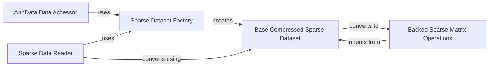

## Component Details

This component overview details the 'Sparse Data Handling' subsystem within AnnData, focusing on how sparse matrices are represented, stored, and manipulated. It highlights the interplay between factory components for creating sparse datasets, abstract base classes defining common interfaces, specialized operations for backed sparse matrices, and accessors for integrating sparse data into AnnData objects. The system ensures efficient handling of large, sparse datasets by abstracting storage specifics and providing consistent access and manipulation patterns.

### Sparse Dataset Factory

This component is responsible for dynamically creating appropriate sparse dataset objects (CSR or CSC) based on the underlying storage format (HDF5 or Zarr). It acts as a central entry point for instantiating sparse data handlers, abstracting away the specifics of the sparse matrix format.

**Related Classes/Methods**:

- <a href="https://github.com/scverse/anndata/blob/master/src/anndata/_core/sparse_dataset.py#L666-L733" target="_blank" rel="noopener noreferrer">`anndata._core.sparse_dataset.sparse_dataset` (666:733)</a>

### Base Compressed Sparse Dataset

This abstract base class defines the common interface and core functionalities for all compressed sparse datasets, whether they are in-memory or backed. It manages the group storage, handles indexing, setting items, and provides methods for converting between backed and in-memory representations. It serves as the foundation for concrete sparse dataset implementations.

**Related Classes/Methods**:

- <a href="https://github.com/scverse/anndata/blob/master/src/anndata/_core/sparse_dataset.py#L399-L403" target="_blank" rel="noopener noreferrer">`anndata._core.sparse_dataset.BaseCompressedSparseDataset` (399:403)</a>

### Backed Sparse Matrix Operations

This component provides specialized operations for sparse matrices that are backed by on-disk storage (HDF5 or Zarr). It handles copying, setting, and zeroing elements while preserving the sparsity structure, and interacts directly with the underlying data, indices, and indptr. It extends the `BaseCompressedSparseDataset` to provide specific functionalities for backed data.

**Related Classes/Methods**:

- <a href="https://github.com/scverse/anndata/blob/master/src/anndata/_core/sparse_dataset.py#L78-L100" target="_blank" rel="noopener noreferrer">`anndata._core.sparse_dataset.BackedSparseMatrix.copy` (78:100)</a>

- <a href="https://github.com/scverse/anndata/blob/master/src/anndata/_core/sparse_dataset.py#L76-L100" target="_blank" rel="noopener noreferrer">`anndata._core.sparse_dataset.BackedSparseMatrix` (76:100)</a>

### AnnData Data Accessor

This component provides the primary interface for accessing the data matrix (X) within an AnnData object. It intelligently handles whether the data is stored in-memory or backed, and if it's a view, it performs necessary subsetting operations, ensuring a consistent access pattern for users.

**Related Classes/Methods**:

- <a href="https://github.com/scverse/anndata/blob/master/src/anndata/_core/anndata.py#L100-L103" target="_blank" rel="noopener noreferrer">`anndata._core.anndata.AnnData.X` (100:103)</a>

### Sparse Data Reader

This component is responsible for reading sparse data from various storage formats and converting it into an in-memory sparse matrix or array for further processing. It leverages the Sparse Dataset Factory to handle the underlying data structure and the Base Compressed Sparse Dataset for conversion.

**Related Classes/Methods**:

- <a href="https://github.com/scverse/anndata/blob/master/src/anndata/_io/specs/methods.py#L895-L896" target="_blank" rel="noopener noreferrer">`anndata._io.specs.methods.read_sparse` (895:896)</a>

### [FAQ](https://github.com/CodeBoarding/GeneratedOnBoardings/tree/main?tab=readme-ov-file#faq)