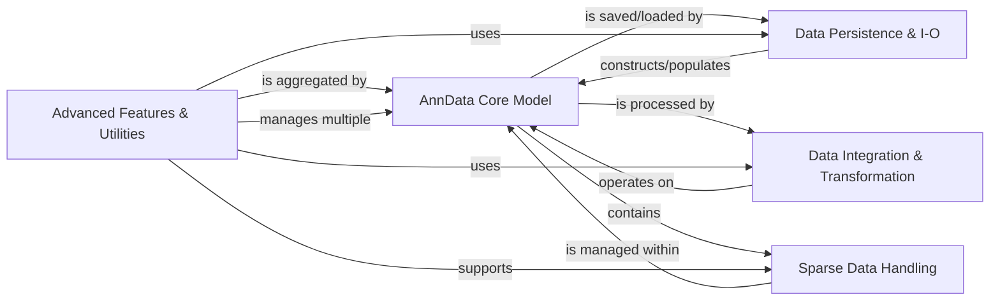

## Component Details

The AnnData library provides a core data structure, `AnnData`, for handling annotated data matrices, particularly in single-cell biology. The architecture is designed to efficiently manage large datasets, supporting both in-memory and out-of-memory (backed) operations. It includes robust I/O capabilities for various file formats, sophisticated data integration and transformation functionalities, and specialized handling for sparse data. Additionally, it offers experimental features for managing collections of AnnData objects and general utilities for common tasks and performance analysis.

### AnnData Core Model

Manages the central AnnData object, its initialization, internal structure (X, obs, var, uns, etc.), and basic in-memory operations like slicing, transposing, and handling of raw data and various data views.

**Related Classes/Methods**:

- <a href="https://github.com/scverse/anndata/blob/master/src/anndata/_core/anndata.py#L211-L257" target="_blank" rel="noopener noreferrer">`anndata.src.anndata._core.anndata.AnnData.__init__` (211:257)</a>

- <a href="https://github.com/scverse/anndata/blob/master/src/anndata/_core/anndata.py#L547-L568" target="_blank" rel="noopener noreferrer">`anndata.src.anndata._core.anndata.AnnData.X` (547:568)</a>

- <a href="https://github.com/scverse/anndata/blob/master/src/anndata/_core/raw.py#L29-L60" target="_blank" rel="noopener noreferrer">`anndata.src.anndata._core.raw.Raw.__init__` (29:60)</a>

- <a href="https://github.com/scverse/anndata/blob/master/src/anndata/_core/views.py#L299-L300" target="_blank" rel="noopener noreferrer">`anndata.src.anndata._core.views.as_view_array` (299:300)</a>

### Data Persistence & I-O

Handles reading from and writing to various file formats (H5AD, Zarr, CSV, Loom, MTX, Excel). It orchestrates the use of I/O specifications and underlying file operations to serialize and deserialize AnnData objects, including mechanisms for file backing and lazy loading.

**Related Classes/Methods**:

- <a href="https://github.com/scverse/anndata/blob/master/src/anndata/_io/h5ad.py#L48-L114" target="_blank" rel="noopener noreferrer">`anndata.src.anndata._io.h5ad.write_h5ad` (48:114)</a>

- <a href="https://github.com/scverse/anndata/blob/master/src/anndata/_io/specs/registry.py#L98-L124" target="_blank" rel="noopener noreferrer">`anndata.src.anndata._io.specs.registry.IORegistry.register_write` (98:124)</a>

- <a href="https://github.com/scverse/anndata/blob/master/src/anndata/_core/file_backing.py#L87-L99" target="_blank" rel="noopener noreferrer">`anndata.src.anndata._core.file_backing.AnnDataFileManager.open` (87:99)</a>

- <a href="https://github.com/scverse/anndata/blob/master/src/anndata/_io/zarr.py#L43-L79" target="_blank" rel="noopener noreferrer">`anndata.src.anndata._io.zarr.write_zarr` (43:79)</a>

### Data Integration & Transformation

Contains the core algorithms and utilities for merging and concatenating AnnData objects and their internal components (arrays, dataframes, indices) along different axes, handling various merge strategies, including experimental on-disk concatenation functionalities.

**Related Classes/Methods**:

- <a href="https://github.com/scverse/anndata/blob/master/src/anndata/_core/merge.py#L1428-L1827" target="_blank" rel="noopener noreferrer">`anndata.src.anndata._core.merge.concat` (1428:1827)</a>

- <a href="https://github.com/scverse/anndata/blob/master/src/anndata/_core/merge.py#L499-L502" target="_blank" rel="noopener noreferrer">`anndata.src.anndata._core.merge.Reindexer.__call__` (499:502)</a>

- <a href="https://github.com/scverse/anndata/blob/master/src/anndata/experimental/merge.py#L411-L673" target="_blank" rel="noopener noreferrer">`anndata.src.anndata.experimental.merge.concat_on_disk` (411:673)</a>

### Sparse Data Handling

Manages the representation, storage, and manipulation of sparse matrices within AnnData objects, including backed sparse matrices and their slicing/subsetting operations, ensuring efficient handling of large, sparse datasets.

**Related Classes/Methods**:

- <a href="https://github.com/scverse/anndata/blob/master/src/anndata/_core/sparse_dataset.py#L100-L103" target="_blank" rel="noopener noreferrer">`anndata.src.anndata._core.sparse_dataset.BackedSparseMatrix.copy` (100:103)</a>

- <a href="https://github.com/scverse/anndata/blob/master/src/anndata/_core/sparse_dataset.py#L160-L167" target="_blank" rel="noopener noreferrer">`anndata.src.anndata._core.sparse_dataset.BaseCompressedSparseDataset.__init__` (160:167)</a>

- <a href="https://github.com/scverse/anndata/blob/master/src/anndata/_core/sparse_dataset.py#L300-L303" target="_blank" rel="noopener noreferrer">`anndata.src.anndata._core.sparse_dataset.sparse_dataset` (300:303)</a>

### Advanced Features & Utilities

Encompasses experimental features for working with collections of AnnData objects, PyTorch integration, and general-purpose utility functions for common tasks, logging, settings management, and performance benchmarking.

**Related Classes/Methods**:

- <a href="https://github.com/scverse/anndata/blob/master/src/anndata/experimental/multi_files/_anncollection.py#L674-L806" target="_blank" rel="noopener noreferrer">`anndata.src.anndata.experimental.multi_files._anncollection.AnnCollection.__init__` (674:806)</a>

- <a href="https://github.com/scverse/anndata/blob/master/src/anndata/utils.py#L368-L398" target="_blank" rel="noopener noreferrer">`anndata.src.anndata.utils.deprecated` (368:398)</a>

- <a href="https://github.com/scverse/anndata/blob/master/src/anndata/_settings.py#L202-L240" target="_blank" rel="noopener noreferrer">`anndata.src.anndata._settings.SettingsManager.register` (202:240)</a>

- <a href="https://github.com/scverse/anndata/blob/master/benchmarks/benchmarks/utils.py#L32-L37" target="_blank" rel="noopener noreferrer">`anndata.benchmarks.benchmarks.utils.get_anndata_memsize` (32:37)</a>

### [FAQ](https://github.com/CodeBoarding/GeneratedOnBoardings/tree/main?tab=readme-ov-file#faq)