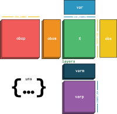

|Stars| |PyPI| |PyPIDownloadsTotal| |PyPIDownloadsMonth| |Conda| |Docs| |Build Status| |Coverage|

.. |Stars| image:: https://img.shields.io/github/stars/scverse/anndata?logo=GitHub&color=yellow
   :target: https://github.com/scverse/anndata/stargazers
.. |PyPI| image:: https://img.shields.io/pypi/v/anndata.svg
   :target: https://pypi.org/project/anndata
.. |PyPIDownloadsTotal| image:: https://pepy.tech/badge/anndata
   :target: https://pepy.tech/project/anndata
.. |PyPIDownloadsMonth| image:: https://img.shields.io/pypi/dm/scanpy?logo=PyPI&color=blue
   :target: https://pypi.org/project/anndata
.. |Conda| image:: https://img.shields.io/conda/vn/conda-forge/anndata.svg
   :target: https://anaconda.org/conda-forge/anndata
.. |Docs| image:: https://readthedocs.com/projects/icb-anndata/badge/?version=latest
   :target: https://anndata.readthedocs.io
.. |Build Status| image:: https://dev.azure.com/scverse/anndata/_apis/build/status/scverse.anndata?branchName=master
   :target: https://dev.azure.com/scverse/anndata/_build
.. |Coverage| image:: https://codecov.io/gh/scverse/anndata/branch/master/graph/badge.svg?token=IN1mJN1Wi8
   :target: https://codecov.io/gh/scverse/anndata

.. after image

anndata - Annotated data
========================

anndata is a Python package for handling annotated data matrices in memory and on disk, positioned between pandas and xarray. anndata offers a broad range of computationally efficient features including, among others, sparse data support, lazy operations, and a PyTorch interface.

* Discuss development on `GitHub <https://github.com/scverse/anndata>`_.
* Read the `documentation <https://anndata.readthedocs.io>`_.
* Ask questions on the `scverse Discourse <https://discourse.scverse.org>`_.
* Install via ``pip install anndata`` or ``conda install anndata -c conda-forge``.
* Consider citing the `anndata paper <https://doi.org/10.1101/2021.12.16.473007>`__.
* See `Scanpy's documentation <https://scanpy.readthedocs.io/>`__ for usage
  related to single cell data. anndata was initially built for Scanpy.
